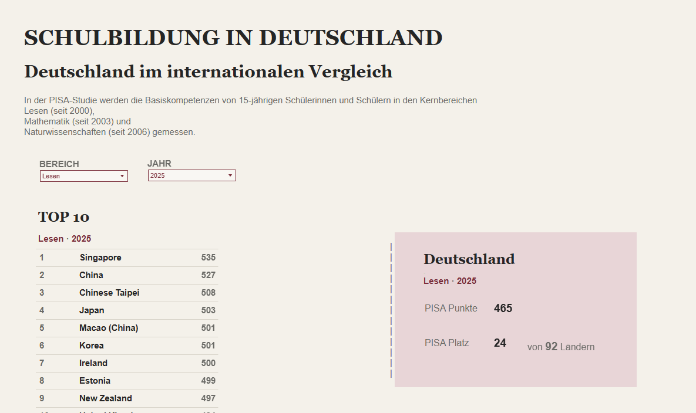

# Wie steht es um das deutsche Bildungssystem? — Eine interaktive Datenanalyse

Dieses Repository dokumentiert die Datenaufbereitung und Konzeption eines interaktiven Tableau-Dashboards, das den aktuellen Zustand des deutschen Bildungssystems beleuchtet. Die Analyse betrachtet Deutschland im internationalen Kontext (OECD/PISA), schlüsselt regionale Leistungsunterschiede auf Bundesländerebene auf und untersucht Leistungsdifferenzen zwischen Gymnasien und der Gesamtschülerschaft.

**[Hier geht es zum interaktiven Tableau Public Dashboard](https://public.tableau.com/views/Schulbildung_in_Deutschland/Dashboard1?:language=en-US&:sid=&:redirect=auth&:display_count=n&:origin=viz_share_link)**

---

## Zielsetzung & Fragestellungen

Das Projekt visualisiert Bildungsdaten über mehrere Aggregationsebenen hinweg und beantwortet drei Kernfragen:

1. **Internationaler Kontext:** Wie schneidet Deutschland im langfristigen OECD-Vergleich ab?
2. **Föderale Dynamik:** Wie stark variieren die Kompetenzwerte zwischen den 16 deutschen Bundesländern?
3. **Schulform-Effekte:** Welcher Leistungsvorsprung zeigt sich an Gymnasien im direkten Vergleich zum Gesamtschnitt?

---

## Datenquellen & Methodik

Da keine einzelne Erhebung alle drei Analyseebenen abdeckt, wurden zwei zentrale Erhebungsreihen kombiniert und harmonisiert:

| Ebene                  | Quelle                                                   | Erhebung                                   | Fokus                                                       |
| ---------------------- | -------------------------------------------------------- | ------------------------------------------ | ----------------------------------------------------------- |
| **International**      | OECD                                                     | PISA-Studie (Veröffentlichung: Sept. 2026) | Globaler Leistungsvergleich & Trendanalysen                 |
| **National / Föderal** | IQB (Institut zur Qualitätsentwicklung im Bildungswesen) | IQB-Bildungstrend                          | Bundesländer-Vergleich & Schulformen (Gymnasium vs. Gesamt) |

### Datenbereinigung & Transformation (ETL)

- **Bereinigung:** Entfernung redundanter Metadatenzeilen, Standardisierung von Ländercodes und Behandlung fehlender Erhebungszeitpunkte.
- **Formatierung:** Reshaping von breiten Tabellenstrukturen (_wide format_) in ein langes, relationales Format (_tall/tidy data_), um flexible Berechnungen und Dimensionsfilter in Tableau zu ermöglichen.
- **Tool-Wahl:** Aufgrund der überschaubaren Zeilenanzahl und tabellarischen Rohdatenstruktur erfolgte die Transformation direkt und performant via Excel.

---

## Interaktives Tableau Dashboard

Das Dashboard ist live auf **Tableau Public** gehostet und modular aufgebaut:

- **Internationale Einordung Deutschlands:** Zentrale KPIs und visuelle Einstiege in die Leistungsindikatoren.
- **Bundesländer-Deep-Dive:** Karten- und Trendvisualisierung zur föderalen Heterogenität.
- **Internationale Explorer-Ansicht:** Über einen interaktiven Button gelangt der Nutzer zu vertiefenden internationalen Filtern.

---

## Repository-Struktur

```text
├── data/
│   ├── raw/            # Rohdaten (OECD PISA & IQB)
│   └── processed/      # Bereinigte, Tableau-optimierte Excel-Dateien
├── docs/               # Screenshots des Dashboards
└── README.md

```
